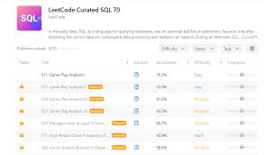

# LeetCode_SQL_Database

This repo contains my SQL solutions for LeetCode problems. Each file includes a problem description, optimized SQL query, and explanations. The goal is to improve SQL skills, share knowledge, and collaborate. Feel free to explore, suggest improvements, or contribute! 🚀

## LeetCode SQL Solutions:-

This repository contains my solutions to SQL problems from LeetCode. Each solution is implemented using MySQL and aims to demonstrate efficient and optimal approaches to solve common database-related challenges.

## Repository Structure:-

Problem Name: Each SQL file is named after the LeetCode problem it solves.
Solution Explanation: Each SQL file includes comments explaining the logic and approach used to solve the problem.
Testing: Sample test cases or scenarios may be included in the comments or README where applicable.
Why This Repository?

## Learning and Practice:-

**This repository serves as a resource for learning SQL techniques for solving algorithmic problems.**

### Collaboration:-

I welcome feedback and suggestions for improving solutions or alternative approaches.
Community: By sharing these solutions, I hope to contribute to the SQL programming community and help others learn and grow.

### Contents:-

Problem 1: Description of the problem and the SQL solution.
Problem 2: Description of the problem and the SQL solution.
Problem 3: Description of the problem and the SQL solution.

### Contributing:-

Feel free to fork this repository, suggest improvements, or submit your own solutions via pull requests. Let's learn and grow together!
